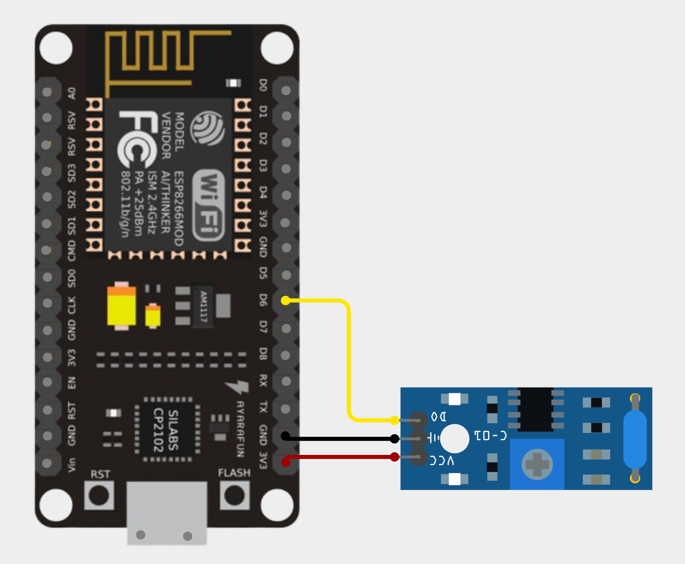
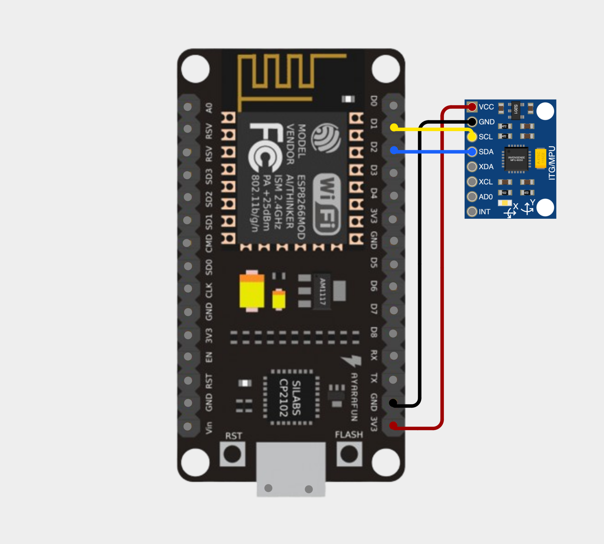
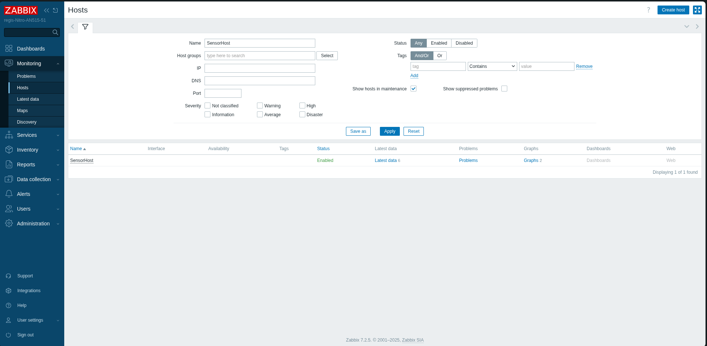
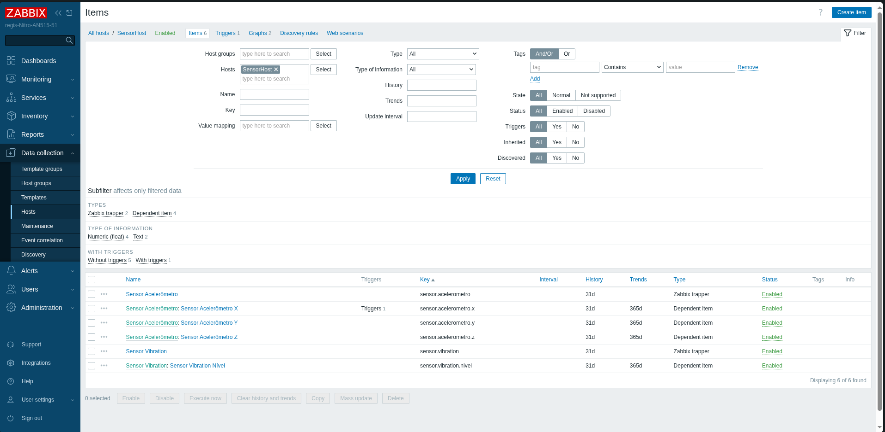
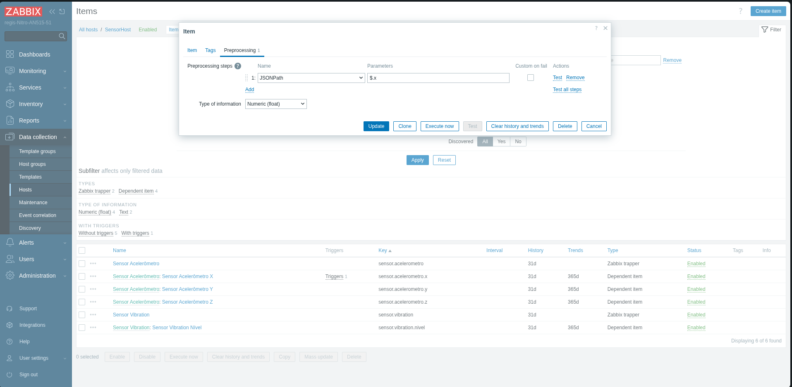
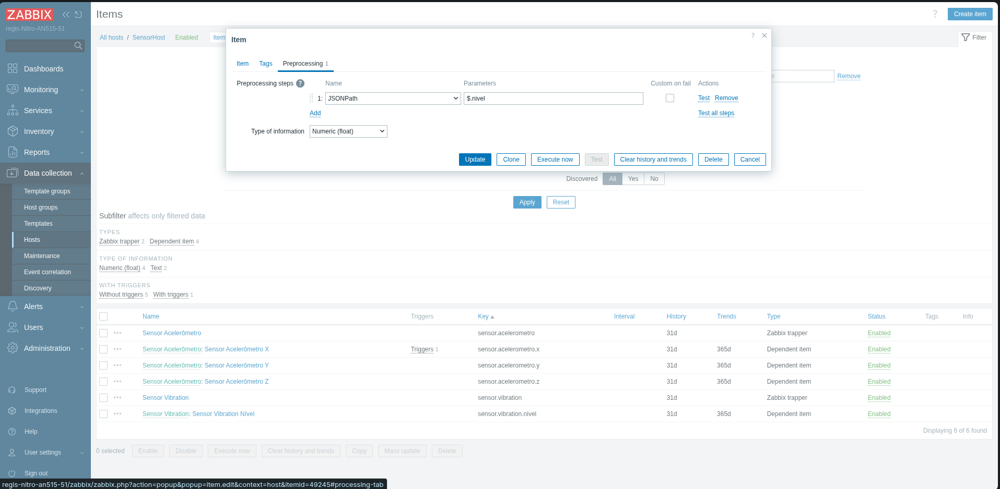

# Sistema de Monitoramento de Vibração para Detecção de Anomalias e Falhas em Máquinas na Indústria 4.0

## 1. Introdução

O avanço da Indústria 4.0 tem impulsionado a integração de tecnologias inteligentes em ambientes industriais, especialmente no que diz respeito ao monitoramento e à manutenção preditiva de máquinas. Falhas inesperadas em equipamentos podem gerar altos custos operacionais, comprometer a segurança e interromper a produção. Nesse contexto, sistemas de detecção precoce de anomalias tornam-se essenciais para garantir a eficiência e a continuidade dos processos.

Este projeto tem como objetivo desenvolver uma solução de monitoramento de vibração utilizando sensores embarcados e comunicação sem fio, com foco na detecção de anomalias e falhas em máquinas industriais. A proposta é explorar diferentes abordagens de conectividade e envio de dados, adaptando-se aos desafios enfrentados em ambientes reais da Indústria 4.0.

## 2. Motivação

Este projeto surge da busca por soluções acessíveis, eficazes e adaptáveis para o monitoramento de equipamentos industriais. Muitas pequenas e médias indústrias ainda enfrentam dificuldades para implementar sistemas de manutenção inteligente, seja por limitações técnicas, financeiras ou estruturais.

Ao explorar tecnologias como ESP8266, Arduino, módulos como o MPU-6050 e a comunicação LoRa, o projeto busca demonstrar que é possível construir sistemas eficientes com baixo custo, ampliando a acessibilidade dessas soluções. A relevância do tema está na prevenção de falhas, na redução de paradas não planejadas e na otimização da manutenção, com impactos diretos sobre a produtividade e a segurança.

Além disso, o desenvolvimento de soluções com foco em IoT industrial pode gerar benefícios sociais e econômicos ao contribuir com a modernização de processos, o aumento da eficiência energética e a redução de desperdícios. Também promove o aprendizado prático em tecnologias embarcadas e sistemas distribuídos, fundamentais para a formação de engenheiros na era da indústria digital.

## Visão Geral do Projeto

O projeto **"Sistema de Monitoramento de Vibração e Detecção de Anomalias na Indústria 4.0"**, desenvolvido como trabalho final para a disciplina de **Projeto de Sistemas Ubíquos e Embarcados** do curso de **Engenharia de Computação da UFSC**, tem como objetivo implementar uma solução inteligente de monitoramento para detecção de falhas em máquinas industriais.

O sistema foi estruturado em **dois cenários distintos**, com o propósito de investigar a melhor abordagem, considerando aspectos específicos dos desenvolvedores.

### Cenário 1 - ESP8266 com sensores

No **primeiro cenário**, foram realizados testes com um **ESP8266** conectado ao módulo **MPU-6050** (acelerômetro) e ao sensor **SW-420** (sensor de vibração), de forma que cada sensor foi utilizado separadamente para coleta de dados. Os dados coletados são transmitidos via **MQTT** e enviados para o **Zabbix**, permitindo o monitoramento remoto e a geração de alertas em tempo real.

### Cenário 2 - Módulos LoRa com Arduino UNO

No **segundo cenário**, dois módulos **Heltec WiFi LoRa 32 V3** são utilizados: um está conectado ao **PC** como receptor dos dados, enquanto o outro está ligado a um **Arduino UNO**, que fornece alimentação ao sistema e coleta os dados do módulo **MPU-6050**.

Neste cenário, os módulos são responsáveis exclusivamente pelo envio dos dados via comunicação **LoRa**, ampliando a cobertura e o alcance do monitoramento. Essa abordagem busca contornar os desafios e limitações da Indústria 4.0.

## Cenário 1 - ESP8266 com sensores

### Requisitos Funcionais

- Capturar dados de vibração com o sensor SW-420 ou de aceleração com o MPU-6050
- Transmitir os dados coletados usando o protocolo MQTT
- Enviar os dados em formato JSON para o broker MQTT
- Encaminhar os dados recebidos para o servidor Zabbix
- Interpretar os dados JSON para separar os componentes recebidos
- Exibir os dados em gráficos por meio do Zabbix
- Integrar o Zabbix ao Grafana para visualizações mais completas
- Permitir a configuração de limites de alerta diretamente no Zabbix

### Requisitos Não Funcionais

**Desempenho**: O sistema deve manter a comunicação eficiente entre sensores e servidor MQTT, garantindo fluxo contínuo de dados
**Escalabilidade**: A arquitetura deve permitir a adição de novos sensores ou dispositivos ESP com alterações mínimas na configuração existente
**Manutenibilidade**: O código deve ser modular e organizado, facilitando atualizações, testes e futuras melhorias
**Portabilidade**: O sistema deve ser compatível com diferentes placas baseadas em ESP8266 ou ESP32, exigindo poucas modificações no código

### Arquitetura

A arquitetura implementada consiste em três componentes principais:

1. **Nós Sensores**: Microcontrolador ESP8266 conectado aos sensores   
2. **Broker MQTT**: Recebe e distribui os dados dos sensores  
3. **Ponte MQTT-Zabbix**: Scripts Python que se inscrevem em tópicos MQTT e encaminham dados para o Zabbix  

<div align="center">

```mermaid
graph TD
   A[ESP8266/Arduino com Sensores] -->|MQTT| B[Broker MQTT]
   B -->|MQTT| C[Ponte MQTT-Zabbix]
   C -->|Zabbix Sender| D[Servidor Zabbix]
```

</div>

### Montagem do Hardware

#### ESP8266 com Sensor de Vibração SW-420



<!-- Espaço para inserir a imagem da ESP32 com o sensor SW-420 -->

#### ESP8266 com módulo MPU-6050



<!-- Espaço para inserir a imagem da ESP32 com o sensor MPU6050 -->

### Sensores Utilizados

* **MPU-6050**: Acelerômetro e giroscópio de 3 eixos para detecção de movimentos
* **SW-420**: Sensor de vibração que fornece leituras digitais e analógicas

### Componentes de Hardware

Para a implementação deste projeto, foram utilizados:
* Placa de desenvolvimento ESP8266
* Módulo MPU-6050
* Sensor de vibração SW-420
* Fonte de alimentação para a placa ESP8266
* Fios de conexão
* Computador rodando broker MQTT e servidor Zabbix

### Software Implementado

O projeto foi desenvolvido utilizando:
* Arduino IDE para a programação da placa ESP8266
* Bibliotecas para ESP8266:
  * `Wire.h`
  * `ESP8266WiFi.h` ou `WiFi.h`
  * `PubSubClient.h`
  * `Adafruit_MPU6050.h` e `Adafruit_Sensor.h` (ou `MPU6050.h`)
* Broker MQTT (Mosquitto)
* Python 3.x com as bibliotecas:
  * `paho-mqtt`
  * `json`
  * `subprocess`
* Servidor Zabbix configurado com hosts e itens específicos

### Implementação

#### 1. Nós Sensores

Para os nós sensores, foram conectados:
* MPU-6050: Pinos SDA (dados), SCL (clock), VCC e GND à placa ESP
* SW-420: Pinos DO (saída digital), AO (saída analógica, presente apenas em alguns módulos), VCC e GND à placa ESP

As bibliotecas Arduino foram instaladas via Gerenciador de Bibliotecas:
* `PubSubClient`
* `Adafruit MPU6050`
* `Adafruit Unified Sensor`

Dois sketches diferentes foram desenvolvidos:
* `mqtt.ino` para o módulo MPU-6050
* `mqtt_sw_420.ino` para o sensor SW-420

#### 2. Broker MQTT

O Mosquitto foi instalado e configurado como broker MQTT usando:

```bash
sudo apt update
sudo apt install mosquitto mosquitto-clients
sudo systemctl enable mosquitto
```

#### 3. Ponte MQTT-Zabbix

Foram desenvolvidos scripts Python que atuam como ponte entre o MQTT e o Zabbix:

```bash
sudo apt install python3 python3-pip zabbix-sender
pip3 install paho-mqtt
```

Dois scripts principais foram criados:
* mqtt2zabbix.py para dados do acelerômetro
* mqtt3zabbix.py para dados de vibração

#### 4. Configuração do Zabbix

A instalação do Zabbix seguiu o tutorial disponível em:
[Tutorial de Instalação do Zabbix](https://github.com/miguelsrrobo/zabbix-install)

Para o monitoramento dos sensores, foi realizada a configuração de:

1. Um host chamado **SensorHost**

   

2. **Configuração para o Acelerômetro**:
   * Um item master do tipo *trapper* chamado "Sensor Acelerômetro" com chave `sensor.acelerometro`
   * Três itens dependentes:
     * "Sensor Acelerômetro: Sensor Acelerômetro X" (chave: `sensor.acelerometro.x`)
     * "Sensor Acelerômetro: Sensor Acelerômetro Y" (chave: `sensor.acelerometro.y`)
     * "Sensor Acelerômetro: Sensor Acelerômetro Z" (chave: `sensor.acelerometro.z`)
   * O pré-processamento de cada item dependente foi configurado usando JSONPath:
     * Para o eixo X: `$.x`
     * Para o eixo Y: `$.y`
     * Para o eixo Z: `$.z`
   
   
   

3. **Configuração para o Sensor de Vibração**:
   * Um item master do tipo *trapper* chamado "Sensor Vibration" com chave `sensor.vibration`
   * Um item dependente:
     * "Sensor Vibration Nível" (chave: `sensor.vibration.nivel`)
   * O pré-processamento foi configurado usando JSONPath:
     * Para o nível: `$.nivel`
   
   

#### 5. Integração com Grafana

Para melhorar a visualização dos dados, foi feita a integração do Zabbix com o Grafana, seguindo o tutorial:
[Tutorial Grafana-Zabbix](https://github.com/RegisBloemer/Grafana-Zabbix-Tutorial)

### Parâmetros de Configuração

#### Configuração das placas ESP8266

Os sketches Arduino foram configurados com:

```cpp
// Credenciais WiFi
const char* ssid     = "SEU_SSID_WIFI";
const char* password = "SUA_SENHA_WIFI";

// Broker MQTT
const char* mqtt_server = "IP_DO_SEU_BROKER_MQTT";
const int   mqtt_port   = 1883;
```

#### Configuração dos Scripts Python

Os scripts de ponte foram configurados com:

```python
# Configurações MQTT
MQTT_BROKER = "IP_DO_SEU_BROKER_MQTT"
MQTT_PORT   = 1883
MQTT_TOPIC  = "sensor/acelerometro"  # ou "sensor/vibracao"

# Configurações Zabbix
ZABBIX_SERVER = "SEU_SERVIDOR_ZABBIX"
ZABBIX_PORT   = 10051
HOSTNAME      = "SensorHost"
```

### Funcionamento do Sistema

O sistema funciona com a placa ESP8266 conectada ao Wi-Fi enviando dados para o broker MQTT. Os scripts Python se inscrevem nos tópicos relevantes e encaminham os dados para o Zabbix usando o comando `zabbix_sender`. Os dados são então processados e visualizados no dashboard do Zabbix ou Grafana.

#### Formato dos Dados Transmitidos

##### Acelerômetro (MPU-6050)

```json
{
  "x": 0.12,
  "y": -0.03,
  "z": 1.02,
  "gyro_x": 0.01,
  "gyro_y": 0.02,
  "gyro_z": -0.01,
  "temp": 24.5
}
```

##### Vibração (SW-420)

```json
{
  "vib": 1,
  "nivel": 845
}
```

### Resolução de Problemas Encontrados

Durante o desenvolvimento, diversos problemas foram solucionados:

#### Problemas com ESP8266
* Problemas de conexão Wi-Fi foram resolvidos verificando SSID e senha
* Problemas de conexão MQTT foram solucionados verificando IP e porta do broker
* Sensores não detectados foram resolvidos verificando fiação e endereços I2C

#### Problemas com MQTT
* A verificação de publicação de dados foi feita usando:
  ```bash
  mosquitto_sub -t "sensor/acelerometro" -v
  mosquitto_sub -t "sensor/vibracao"   -v
  ```

#### Problemas com Zabbix
* Problemas de recebimento de dados no Zabbix foram testados manualmente:
  ```bash
  zabbix_sender -z SEU_SERVIDOR_ZABBIX -p 10051 \
              -s "SensorHost" \
              -k sensor.acelerometro \
              -o '{"x":0,"y":0,"z":0}'
  ```
  
## Cenário 2 - Módulos LoRa com Arduino UNO

### Requisitos Funcionais 

- Trocar dados entre os módulos utilizando comunicação LoRa de forma contínua e confiável.
- Utilizar o Arduino UNO como base de alimentação, coleta e transmissão inicial dos dados dos sensores.
- Receber os dados transmitidos no módulo conectado ao computador para posterior análise ou visualização.
- Realizar um pré-processamento local dos dados (como filtragem ou ajuste de formato) antes de enviá-los por LoRa.
  
### Requisitos Não Funcionais

- **Desempenho**: Garantir que a troca de mensagens entre os módulos ocorra de forma fluida e estável
- **Escalabilidade**: Permitir a adição de novos sensores ou módulos LoRa com poucas alterações no sistema
- **Manutenibilidade**: Manter o código modular e bem comentado para facilitar futuras modificações
- **Portabilidade**: Garantir compatibilidade com outras placas Arduino e módulos LoRa com pequenas adaptações
